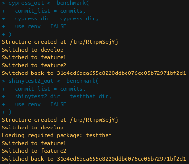

# Setup

## How to install shiny.benchmark?

`shiny.benchmark` can use two different engines to test the changes in the performance of your application: [shinytest2](https://rstudio.github.io/shinytest2/) and [Cypress](https://www.cypress.io/). The latter requires `Node` (version 12 or higher) and `yarn` (version 1.22.17 or higher) to be available. To install them on your computer, follow the guidelines on the documentation pages:

- [Node](https://nodejs.org/en/download/)
- [yarn](https://yarnpkg.com/getting-started/install)

Besides that, on Linux, it might be required to install other `Cypress` dependencies. Check the [documentation](https://docs.cypress.io/guides/getting-started/installing-cypress#Linux-Prerequisites) to find out more.

To install `shiny.benchmark` use the following command:

```r
remotes::install_github("Appsilon/shiny.benchmark")
```

`shiny.benchmark` will handle `Cypress` installation. If you face any inconvenience using `Cypress`, please try to use `shinytest2` in the rest of this tutorial.

----

# Create an initial application

Let's start by creating an application that will serve us as a guide through the `shiny.benchmark` functionalities.

Save the following code as `ui.R`. It is a simple user interface containing three columns with one action button in each. Also each column has an output which will be created in the server file later.

```r
function() {
  bootstrapPage(
    tags$h1("Measuring time in different commits"),
    column(
      width = 4,
      actionButton(inputId = "run1", label = "Run 1"),
      uiOutput(outputId = "out1")
    ),
    column(
      width = 4,
      actionButton(inputId = "run2", label = "Run 2"),
      uiOutput(outputId = "out2")
    ),
    column(
      width = 4,
      actionButton(inputId = "run3", label = "Run 3"),
      uiOutput(outputId = "out3")
    )
  )
}
```

In the server side, the application will use the `Sys.sleep` function to simulate a task every time the user press a button. This will be helpful for us since we can easily increase/decrease the sleep time to simulate improvements/deterioration of the application. Save the following code as `server.R`:

```r
times <- c(10, 5, 2)

function(input, output, session) {
  # Sys.sleep
  react1 <- eventReactive(input$run1, {
    out <- system.time(
      Sys.sleep(times[1] + rexp(n = 1, rate = 1))
    )

    return(out[3])
  })

  react2 <- eventReactive(input$run2, {
    out <- system.time(
      Sys.sleep(times[2] + rexp(n = 1, rate = 1))
    )

    return(out[3])
  })

  react3 <- eventReactive(input$run3, {
    out <- system.time(
      Sys.sleep(times[3] + rexp(n = 1, rate = 1))
    )

    return(out[1])
  })

  # outputs
  output$out1 <- renderUI({
    tags$span(round(react1()), style = "font-size: 5vw;")
  })

  output$out2 <- renderUI({
    tags$span(round(react2()), style = "font-size: 5vw;")
  })

  output$out3 <- renderUI({
    tags$span(round(react3()), style = "font-size: 5vw;")
  })
}
```

The application should look like this:

```r
shiny::runApp()
```


----

# Tests engines

`shiny.benchmark` works under two different engines: `Cypress` and `shinytest2`.

## shinytest2

`shinytest2` is an R package maintained by [Posit](https://posit.co/) (formerly RStudio). It is handy for R users since all tests can be done using R only (differently than Cypress). To set up it easily, run `shinytest2::use_shinytest2()`. It will create configuration files which you do not need to change for this tutorial.

Save the following code as `tests/testthat/test-set1.R`:

```r
app <- AppDriver$new(name = "test1", height = 975, width = 1619)

test_that("Out1 time elapsed - set1", {
  app$click("run1")
  app$expect_values(output = "out1")
})

test_that("Out2 time elapsed - set1", {
  app$click("run2")
  app$expect_values(output = "out2")
})

test_that("Out3 time elapsed - set1", {
  app$click("run3")
  app$expect_values(output = "out3")
  app$stop()
})
```

This code is simulating clicks in the three buttons we have in our application. Also it waits for the outputs to appear. In a new file, replace `set1` by `set2` in the code and save it as `tests/testthat/test-set2.R` as well. It will be useful to present some functionalities later.

```r
app <- AppDriver$new(name = "test1", height = 975, width = 1619)

test_that("Out1 time elapsed - set2", {
  app$click("run1")
  app$expect_values(output = "out1")
})

test_that("Out2 time elapsed - set2", {
  app$click("run2")
  app$expect_values(output = "out2")
})

test_that("Out3 time elapsed - set2", {
  app$click("run3")
  app$expect_values(output = "out3")
  app$stop()
})
```

## Cypress

Cypress is a widely used end to end testing JavaScript library. Because its broader usage, this engine allows the user to take advantage of a huge number of functionalities in order to test its applications. Also, the community is active and therefore it is easier to find solution for bugs you may encounter while coding.

Save the following code as `tests/cypress/test-set1.js`:

```r
describe('Cypress test', () => {
  it('Out1 time elapsed - set1', () => {
    cy.visit('/');
    cy.get('#run1').click();
    cy.get('#out1', {timeout: 10000}).should('be.visible');
  });

  // Test how long it takes to wait for out2
  it('Out2 time elapsed - set1', () => {
    cy.get('#run2').click();
    cy.get('#out2', {timeout: 10000}).should('be.visible');
  });

  // Test how long it takes to wait for out3
  it('Out3 time elapsed - set1', () => {
    cy.get('#run3').click();
    cy.get('#out3', {timeout: 10000}).should('be.visible');
  });
});
```

Again, replace `set1` by `set2` in the code and save it as `tests/cypress/test-set2.R` as well.

```r
describe('Cypress test', () => {
  it('Out1 time elapsed - set2', () => {
    cy.visit('/');
    cy.get('#run1').click();
    cy.get('#out1', {timeout: 10000}).should('be.visible');
  });

  // Test how long it takes to wait for out2
  it('Out2 time elapsed - set2', () => {
    cy.get('#run2').click();
    cy.get('#out2', {timeout: 10000}).should('be.visible');
  });

  // Test how long it takes to wait for out3
  it('Out3 time elapsed - set2', () => {
    cy.get('#run3').click();
    cy.get('#out3', {timeout: 10000}).should('be.visible');
  });
});
```


----

# Package management

During the development process, it is normal to use different packages/package versions. `renv` allow us to manage package versions and is used by `shiny.benchmark` by default. Run the following code to setup `renv` in our test application.

```r
renv::init()
renv::install(c("shiny", "shiny.benchmark"))
renv::snapshot(prompt = FALSE)
```


----

# Simulating app versions

In a regular project, you use `git` to maintain the code versioning. In this case, it is natural to have different app's versions in different branches/commits/releases. `shiny.benchmark` take advantage of these different `git` refs to run tests under different code versions. Add the following code to `.gitignore` to avoid problems with uncommitted files later:

```git
.Rhistory
.Rproj.user/
renv/
```

Now, lets create a `git` repo and commit the current application into the `develop` branch:

```git
git init
git checkout -b develop
git add .
git commit -m "first commit"
```

Also, let's create a new branch called `feature1`:

```git
git checkout -b feature1
```

At this point, we can simulate improvement in our application. To do so, let's change `Sys.sleep` time in the server function. Replace `times <- c(10, 5, 2)` by `times <- c(5, 2.5, 1)` in first row of `server.R` and then commit the changes.

```git
git add server.R
git commit -m "improving performance"
```

To play with `renv` let's downgrade `shiny` version and snapshot it:

```git
git checkout -b feature2
```

Replace `times <- c(5, 2.5, 1)` by `times <- c(2.5, 1.25, 0.5)` in first row of `server.R`. Also, run the following code to downgrade `shiny`:

```r
renv::install("shiny@1.6.0")
renv::snapshot(prompt = FALSE)
```

Commit the changes:

```git
git add .
git commit -m "downgrading shiny"
git checkout develop
```

Great! We are all set!

----

# shiny.benchmark

Now we have all ingredients needed: An application, a set of tests and different versions in a `git` repo. `shiny.benchmark::benchmark` function has only two mandatory arguments:

- `commit_list`: a named list of `git` refs (commit hashes, branch names, tags, ...)
- `cypress_dir` or `shinytest2_dir`: path to `Cypress` or `shinytest2` tests

By default, `shiny.benchmark` uses `renv`. To turn `renv` off just set `use_renv = FALSE` in the `benchmark` call. Be aware that this function will take a while to run since the application will be started and tested 3 times (`develop`, `feature1` and `using_renv` branches).

```r
library(shiny.benchmark)

commits <- list(
  "develop" = "develop",
  "feature1" = "feature1",
  "using_renv" = "feature2"
)

cypress_dir <- "tests/cypress/"
testthat_dir <- "tests/"

cypress_out <- benchmark(
  commit_list = commits,
  cypress_dir = cypress_dir,
  use_renv = FALSE
)

shinytest2_out <- benchmark(
  commit_list = commits,
  shinytest2_dir = testthat_dir,
  use_renv = FALSE
)
```

Instead of a branch name, you can also use the hash code of a desired commit. The console should display something similar to:



You can access the results using `cypress_out$performance` or `shinytest2_out$performance`:

```r
cypress_out$performance
```

```{r echo = FALSE, eval = TRUE}
list(develop = list(structure(list(date = structure(c(1673034247, 
1673034247, 1673034247, 1673034247, 1673034247, 1673034247), class = c("POSIXct", 
"POSIXt"), tzone = ""), rep_id = c(1L, 1L, 1L, 1L, 1L, 1L), test_name = c("Out1 time elapsed - set1", 
"Out2 time elapsed - set1", "Out3 time elapsed - set1", "Out1 time elapsed - set2", 
"Out2 time elapsed - set2", "Out3 time elapsed - set2"), duration_ms = c(10782L, 
6091L, 2804L, 10591L, 6768L, 3944L)), class = "data.frame", row.names = c(NA, 
-6L))), feature1 = list(structure(list(date = structure(c(1673034279, 
1673034279, 1673034279, 1673034279, 1673034279, 1673034279), class = c("POSIXct", 
"POSIXt"), tzone = ""), rep_id = c(1L, 1L, 1L, 1L, 1L, 1L), test_name = c("Out1 time elapsed - set1", 
"Out2 time elapsed - set1", "Out3 time elapsed - set1", "Out1 time elapsed - set2", 
"Out2 time elapsed - set2", "Out3 time elapsed - set2"), duration_ms = c(6471L, 
6442L, 1422L, 5613L, 3593L, 1272L)), class = "data.frame", row.names = c(NA, 
-6L))), using_renv = list(structure(list(date = structure(c(1673034314, 
1673034314, 1673034314, 1673034314, 1673034314, 1673034314), class = c("POSIXct", 
"POSIXt"), tzone = ""), rep_id = c(1L, 1L, 1L, 1L, 1L, 1L), test_name = c("Out1 time elapsed - set1", 
"Out2 time elapsed - set1", "Out3 time elapsed - set1", "Out1 time elapsed - set2", 
"Out2 time elapsed - set2", "Out3 time elapsed - set2"), duration_ms = c(3941L, 
3010L, 995L, 3082L, 2130L, 2458L)), class = "data.frame", row.names = c(NA, 
-6L))))
```

You can notice that both tests files are reported (`test-set1` and `test-set2`). Also, the result is a list of `data.frames` in which each entry correspond to a specific commit.

For now on we will use only `shinytest2`. However, everything is also applied for `Cypress`.

## Package management

In order to use `renv`, simply assign `use_renv = TRUE`. You can also use `renv_prompt = TRUE` if you want to see what renv is applying in the background.

```r
shinytest2_out <- benchmark(
  commit_list = commits,
  shinytest2_dir = testthat_dir,
  use_renv = TRUE,
  renv_prompt = TRUE
)
```

## Handling multiple files

Sometimes it is not our interest to measure performance of all the tests we have. In order to select specific files you can use the argument `tests_pattern`. This argument accept either a vector of files (one for each item in commit list). Also, it is possible to search for a pattern in `tests` files.

```r
shinytest2_out <- benchmark(
  commit_list = commits,
  shinytest2_dir = testthat_dir,
  use_renv = FALSE,
  tests_pattern = c("set[0-9]", "set1", "set2")
)
shinytest2_out$performance
```

```{r echo=FALSE}
list(develop = list(structure(list(date = structure(c(1673034247, 
1673034247, 1673034247, 1673034247, 1673034247, 1673034247), class = c("POSIXct", 
"POSIXt"), tzone = ""), rep_id = c(1L, 1L, 1L, 1L, 1L, 1L), test_name = c("Out1 time elapsed - set1", 
"Out2 time elapsed - set1", "Out3 time elapsed - set1", "Out1 time elapsed - set2", 
"Out2 time elapsed - set2", "Out3 time elapsed - set2"), duration_ms = c(12.0559999999996, 
8.16600000000017, 6.94699999999921, 13.3299999999999, 7.09899999999925, 
6.84699999999975)), class = "data.frame", row.names = c(NA, -6L
))), feature1 = list(structure(list(date = structure(c(1673034279, 
1673034279, 1673034279), class = c("POSIXct", "POSIXt"), tzone = ""), 
    rep_id = c(1L, 1L, 1L), test_name = c("Out1 time elapsed - set1", 
    "Out2 time elapsed - set1", "Out3 time elapsed - set1"), 
    duration_ms = c(6.96900000000005, 5.58899999999994, 3.23300000000017
    )), class = "data.frame", row.names = c(NA, -3L))), using_renv = list(
    structure(list(date = structure(c(1673034314, 1673034314, 
    1673034314), class = c("POSIXct", "POSIXt"), tzone = ""), 
        rep_id = c(1L, 1L, 1L), test_name = c("Out1 time elapsed - set2", 
        "Out2 time elapsed - set2", "Out3 time elapsed - set2"
        ), duration_ms = c(4.59799999999996, 4.01999999999953, 
        3.41100000000006)), class = "data.frame", row.names = c(NA, 
    -3L))))
```

Now the output is sightly different. For `develop` branch both files (`test-set1` and `test-set2`) are in use since they match the `test-set[0-9]` pattern. For `feature1` and `feature2` only one file is in use since we directly requested `test-set1` and `test-set2` files respectively. It can be useful when new tests are added during the development process and you need to run different tests for different versions.

## Repetitions 

Sometimes it is important to repeat the measurement several times to have a distribution of the performance times instead of an unique measurement. To do so, it is possible to use the `n_rep argument` as follows:

```r
shinytest2_out <- benchmark(
  commit_list = commits,
  shinytest2_dir = testthat_dir,
  use_renv = FALSE,
  tests_pattern = "set1",
  n_rep = 5
)
```

It is faster than running the benchmark several times since the test structure is created only once internally saving some execution time.

Some methods are implemented to make it easy to explore the results. `summary` brings summarized statistics as mean, median, minimum and maximum while `plot` shows a plot with the average times for each `git` ref and test. Also it presents maximum and minimum range.

```r
summary(shinytest2_out)
```

```{r echo = FALSE}
structure(list(commit = c("develop", "develop", "develop", "feature1", 
"feature1", "feature1", "using_renv", "using_renv", "using_renv"
), test_name = c("Out1 time elapsed - set1", "Out2 time elapsed - set1", 
"Out3 time elapsed - set1", "Out1 time elapsed - set1", "Out2 time elapsed - set1", 
"Out3 time elapsed - set1", "Out1 time elapsed - set1", "Out2 time elapsed - set1", 
"Out3 time elapsed - set1"), n = c(5L, 5L, 5L, 5L, 5L, 5L, 5L, 
5L, 5L), mean = c(12.3748, 7.37940000000017, 5.71140000000014, 
7.72180000000008, 5.35640000000003, 4.28839999999982, 5.36419999999998, 
4.74899999999998, 4.52899999999991), median = c(12.2960000000003, 
7.1279999999997, 6.1220000000003, 7.32099999999991, 5.4320000000007, 
4.39900000000034, 5.34699999999975, 4.79299999999967, 4.5019999999995
), sd = c(0.473558549706366, 0.628408147624124, 1.21808653223053, 
1.07820856052986, 0.603523653223451, 0.775558379491765, 0.455512019599966, 
0.748540246078935, 0.982901826227147), min = c(11.9110000000001, 
6.91499999999996, 4.26799999999912, 7.01000000000022, 4.76000000000022, 
3.1279999999997, 4.9340000000002, 3.70100000000002, 3.65899999999965
), max = c(13.1099999999997, 8.45000000000073, 7.15100000000075, 
9.61200000000008, 6.27800000000025, 5.26899999999932, 6.10800000000017, 
5.50500000000011, 6.11400000000049)), class = c("tbl_df", "tbl", 
"data.frame"), row.names = c(NA, -9L))
```

```r
plot(shinytest2_out)
```


----

**Congratulations! You are now able to apply your knowledge to check the performance improvements in your own projects!**
